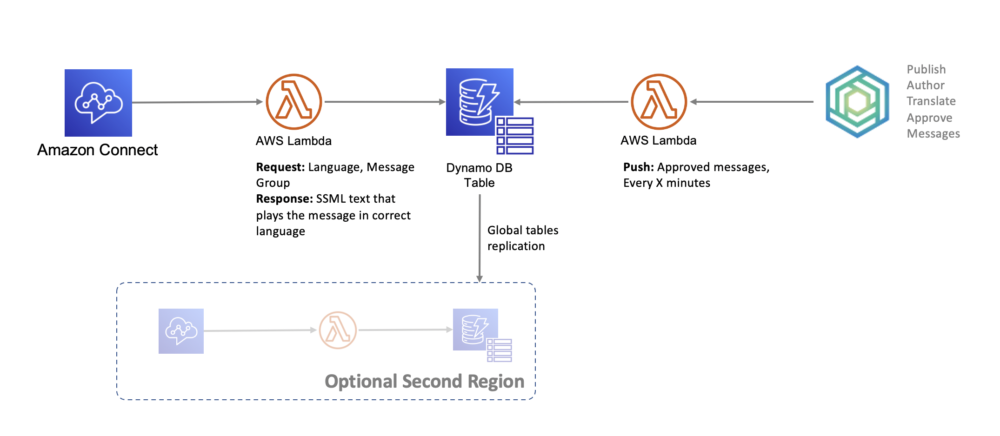
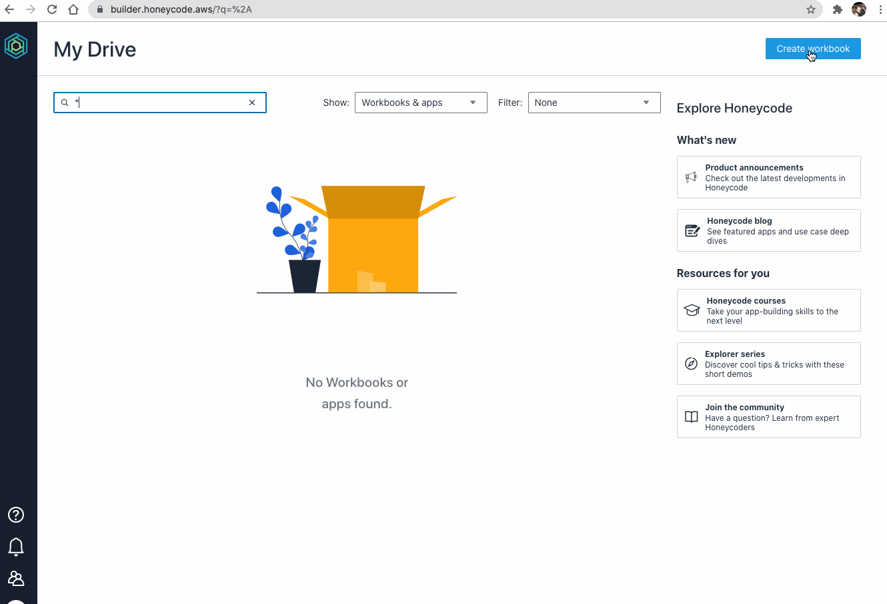
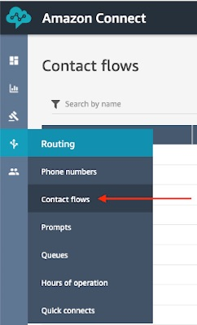
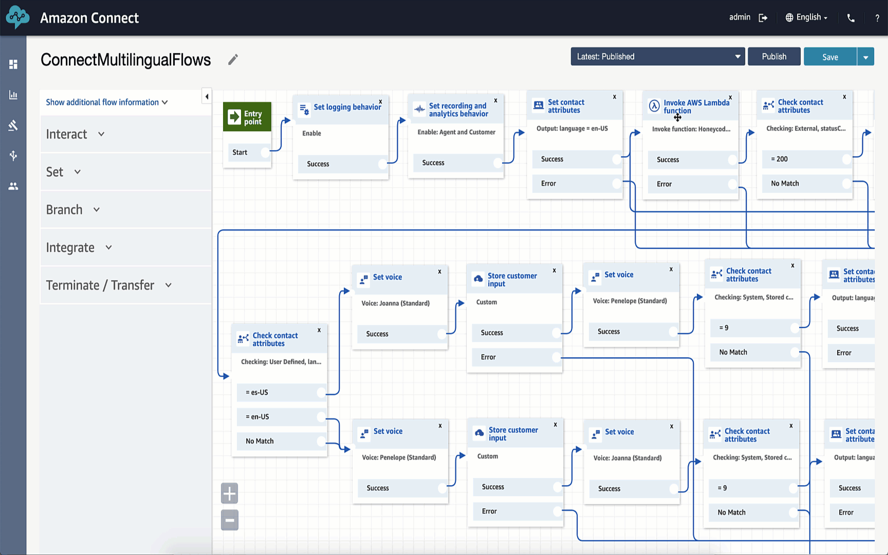
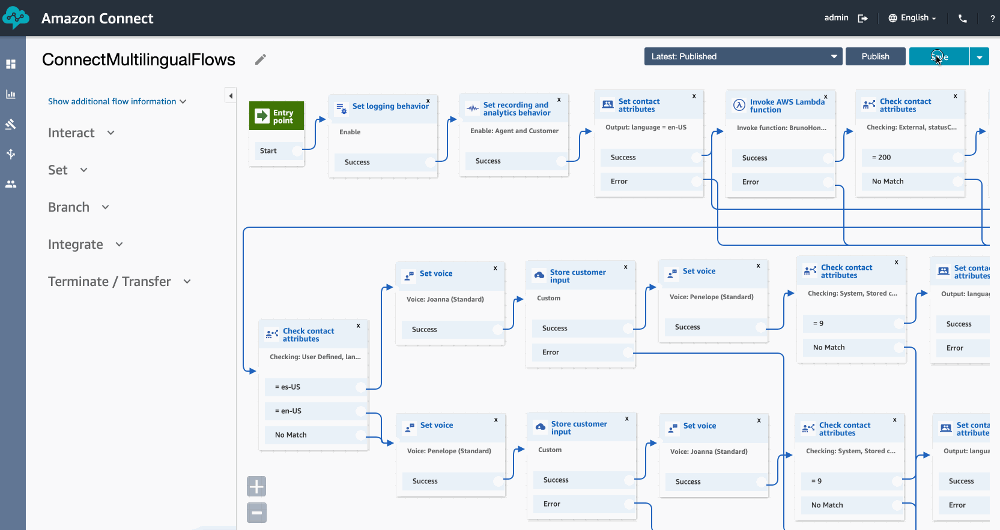
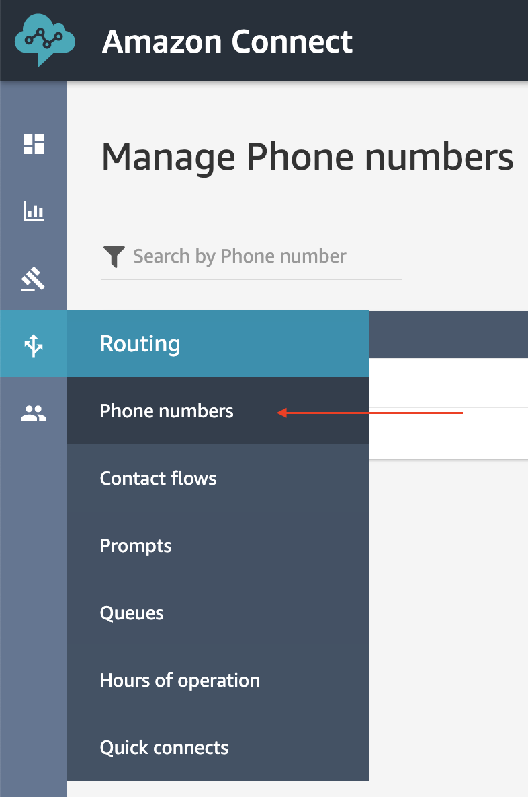
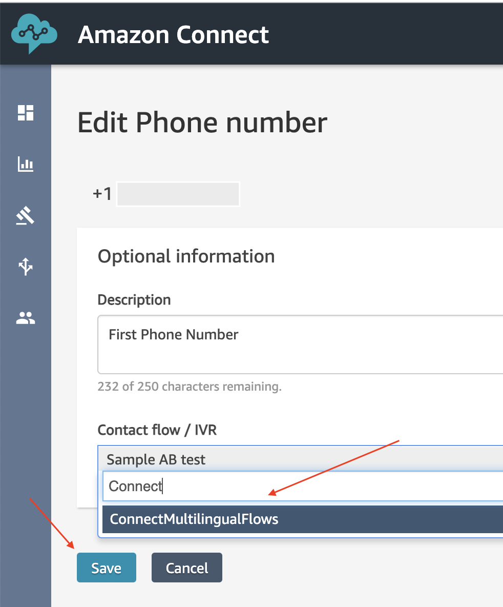

# Amazon Connect + Amazon Honeycode Integration sample

Before we dive into the step-by-step lab, here is the architecture of the solution.


## Overview and Prerequisites
This lab should take about 30-60 minutes. The expertise level is: Medium. You will
not have to code, but will need to be able to execute commands on the command line,
change text files, navigate the AWS console.

Prerequisites for this lab:
- Amazon Honeycode account - where you will instantiate and use a template.
  - If you don’t have one already, [create a new Honeycode account](https://www.honeycode.aws) and login to your Honeycode account. To get started with Honeycode API you need to [link your Honeycode team with your AWS Account](https://honeycodecommunity.aws/t/connecting-honeycode-to-an-aws-account/98)
- Amazon Connect virtual contact center instance - where you will import a new Contact flow to test the integration.
  - If you don’t have one already, [follow the instructions here](https://ai-services.go-aws.com/40_connect-transcribe/20_connect.html) (up to and including claim a phone number)
- [AWS Cloud9 IDE](https://aws.amazon.com/cloud9/) - where you will download this repository and execute a few CDK commands. These commands will automatically setup all the necessary AWS resources and permissions.
  - This may take a few minutes to complete. Following is the recommended configuration for this lab:
      * Name: Honeycode Connect Lab
      * Environment type: Create a new EC2 instance for environment (direct access)
      * Instance type: t2.micro (1 GiB RAM + 1 vCPU)
      * Platform: Amazon Linux 2 (recommended)
      * Cost-saving setting: After 30 minutes (default)

  > Note: If you’d like to use your own machine for deploying this code, you can do so by following the instructions to [install and configure AWS CDK](https://docs.aws.amazon.com/cdk/latest/guide/getting_started.html#getting_started_prerequisites)

- AWS Console - where you will be looking at DynamoDB tables, set permissions for
  Connect to access Lambda functions.
- Permissions - you will need Developer level permissions, specifically to setup
  the above services.

Cost of this lab:
- This lab will cost a few cents to run. The costs will be in AWS Lambda function
  executions, and several calls (charged by the minute) to the Amazon Connect.
- To avoid un-expected charges, please destroy this lab when you are done, and do not
  give access or the phone number (used in this lab) to anybody else.

## Instantiate Amazon Honeycode Template

1. Create a new Workbook using the Connect Manager template


2. Open Builder > **Call Center Manager** app, right click on any screen, click on **Get ARN and IDs**, and copy the **Workbook ID.** For help with this step refer to the [Getting started with APIs](https://honeycodecommunity.aws/t/getting-started-with-honeycode-apis/790#accessing-arn-and-ids) article in Honeycode Community

> *Note: If you are part of multiple teams in Honeycode, make sure to create the Workbook in the team which is linked to your AWS account*.

## Deploy the accompanying code

1. Create/Open a [AWS Cloud9](https://aws.amazon.com/cloud9/) IDE instance.
2. Download the source package by running the following commands on the Cloud9 terminal
```
git clone https://github.com/aws-samples/amazon-honeycode-connect-integration-sample.git
cd amazon-honeycode-connect-integration-sample
```
> Note: Open **bin/honeycode_connect_lab.js** to view the name of the stack and rename the stack from **HoneycodeConnectLab** to say **JohnHoneycodeConnectLab** by adding your first name so it is easier to identify the resources that you create
3. Open **lambda/env.json and update the **workbookId** with the value copied from your *Connect Manager* Honeycode app
    * **lambda/env.json**
4. Run the following commands to start the deployment. This will take a few minutes to complete.
```
npm install -gf aws-cdk
npm install
cdk bootstrap
cdk deploy
```
> Note: Running cdk deploy will do the following
>    * Create the DynamoDB table, and S3 bucket
>    * Create the Lambda functions
>    * Create the event source (DynamoDB, S3 or Event Timer) for the Lambda functions
>    * Add permissions for the Lambda to access Honeycode

## Deploy an Amazon Connect flow

1. Open your [AWS Console for Connect](https://console.aws.amazon.com/connect/)

2. Grant Amazon Connect permission to execute your AWS Lambda function
Ensure that your Amazon Connect instance has permissions to access this newly created AWS Lambda Function by following these steps.

- Select Amazon Connect in the AWS Management Console.
- Select your Amazon Connect virtual contact center instance.
- Choose Contact flows and scroll down to the AWS Lambda section.
- On the Function drop-down menu, select the `ConnectPullPromptsFromDyn` function and click on +Add Lambda Function, as shown in the following image:


> Note: Your lambda name would look like: HoneycodeConnectLab-ConnectPullPromptsFromDyn-[IDENTIFIER] where the [IDENTIFIER] is the unique and random value that CDK assigned to the resource.

3. Import a contact flow
- Log in to your Amazon Connect instance. The account must be assigned a security profile that includes edit permissions for contact flows.
Your Connect console URL would look like:
[https://[INSTANCEID].my.connect.aws/home](https://[INSTANCEID].my.connect.aws/home
)
- On the navigation menu, choose Routing, Contact flows.

  
- Do one of the following:
  - To replace an existing contact flow with the one you are importing, open the contact flow to replace.
  - Create a new contact flow of the same type as the one you are importing.
- Choose Save, Import flow.
- Select the file to import, and choose Import. When the contact flow is imported into an existing contact flow, the name of the existing contact flow is updated, too.
  - The file to import the flow is located in this repository in the (data) folder.
  [ConnectMultilingualFlows](../data/ConnectMultilingualFlows)
- Review and update any resolved or unresolved references as necessary.
  
- To save the imported flow, choose Save. To publish, choose Save and Publish.
  
- On the navigation menu, choose Routing, Phone numbers.

  
- Select the flow we just imported as the default flow for your number.

  

## Try it out

The Honeycode workbook has three apps, one for each role: a) Shift Supervisor, b) Call Center Manager, and c) Customer Support Director.
You can use the Customer Support Director app to exercise all the capabilities. Please watch this video to see the app in action and of course try it out for yourself.

https://www.twitch.tv/videos/936843139?collection=SWZxnzN9aRYK9A


## Optional enhancements

### Second Region

Amazon Honeycode currently runs in US-WEST-2, but if your Amazon Connect instance is in a different region you can still use this solution with DynamoDB Global Tables and
replicate the data to a table in the region where your Amazon Connect runs.

### Edit other messages in the flow


## Cleanup

1. Remove the Serverless API application by running the following command in your Cloud9 IDE
```
cdk destroy
```
2. Delete the Cloud9 IDE by opening the [Cloud9 console](https://us-west-2.console.aws.amazon.com/cloud9/home?region=us-west-2) and clicking on Delete
3. To get obsolete contact flows out of your way, we recommend appending zzTrash_ to their name. This will also make them easy to find should you want to reuse them in the future.
